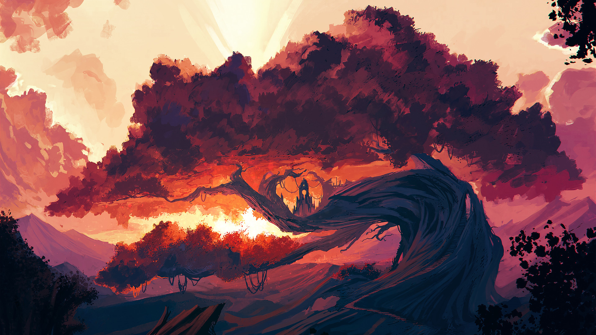
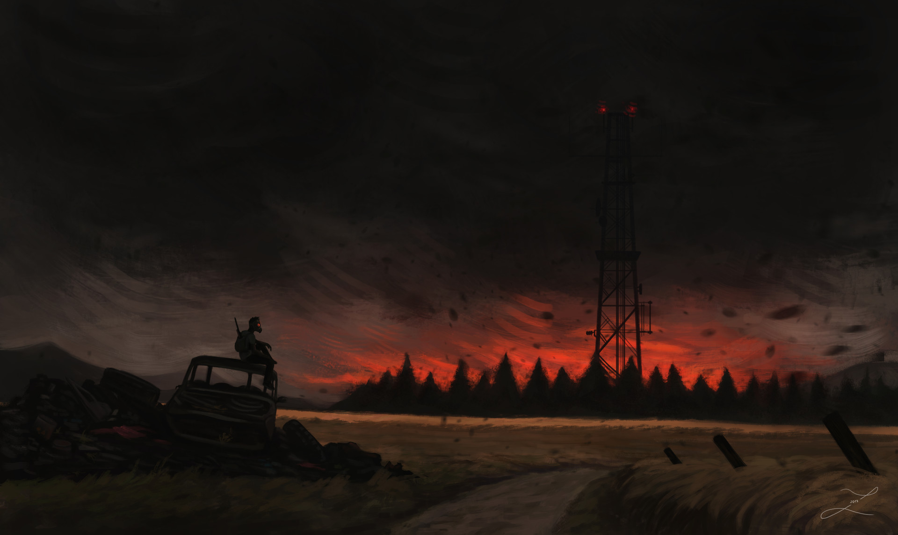
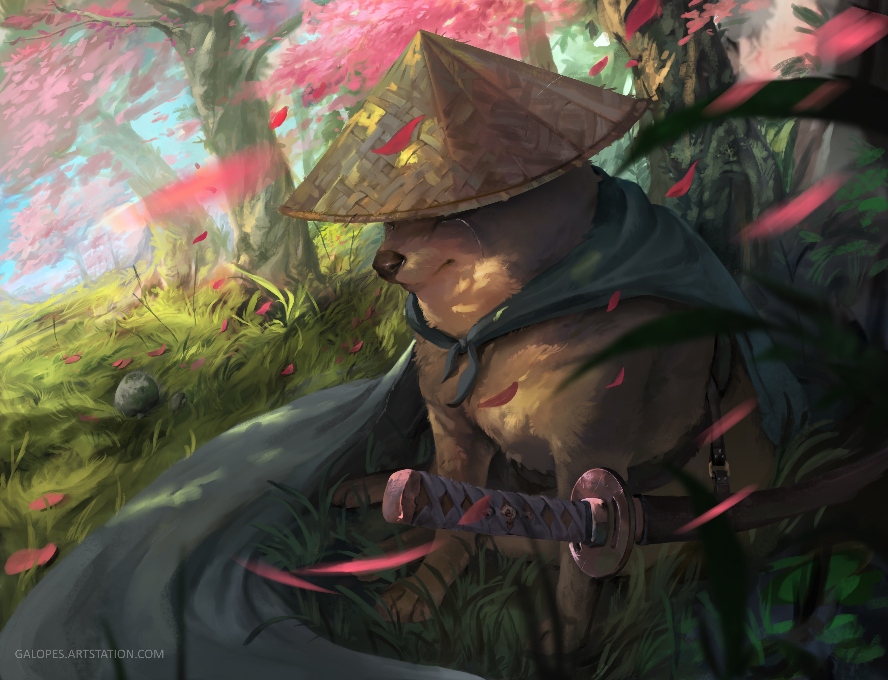
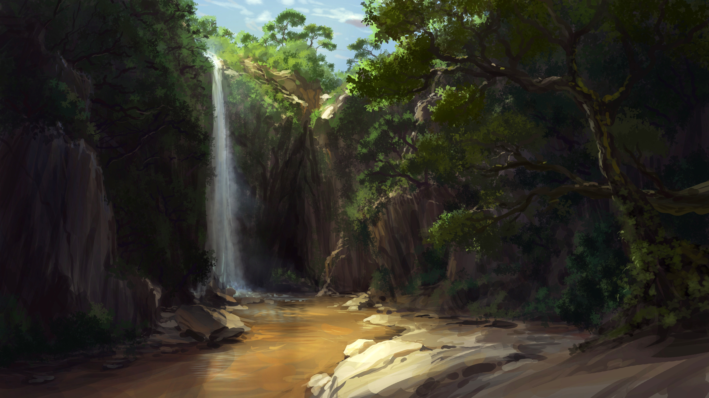
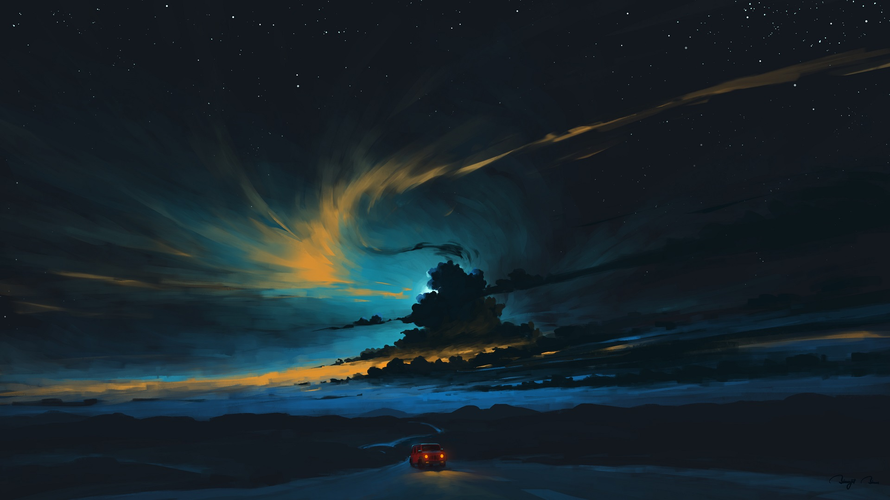
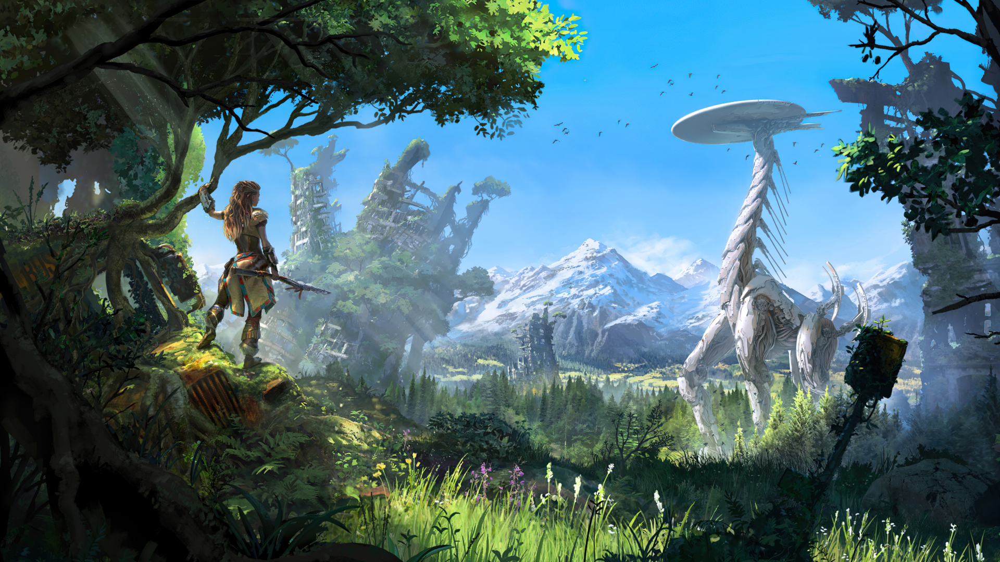
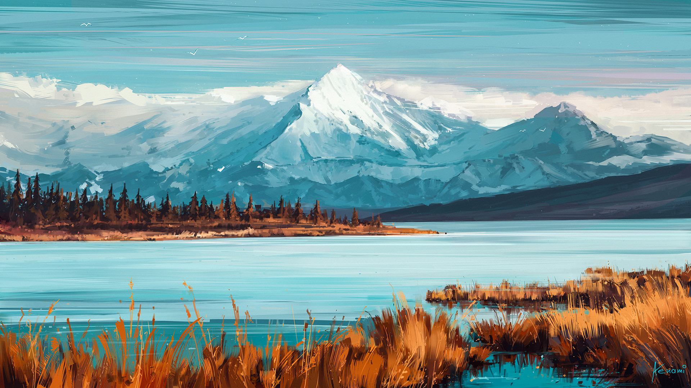
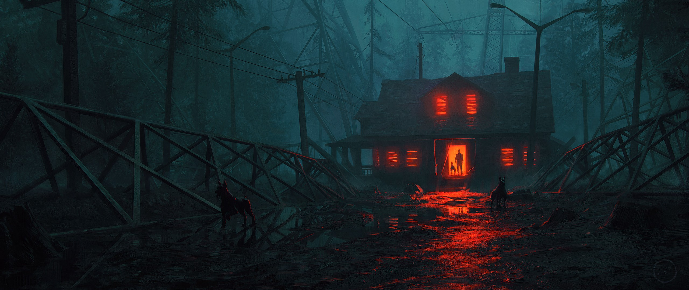
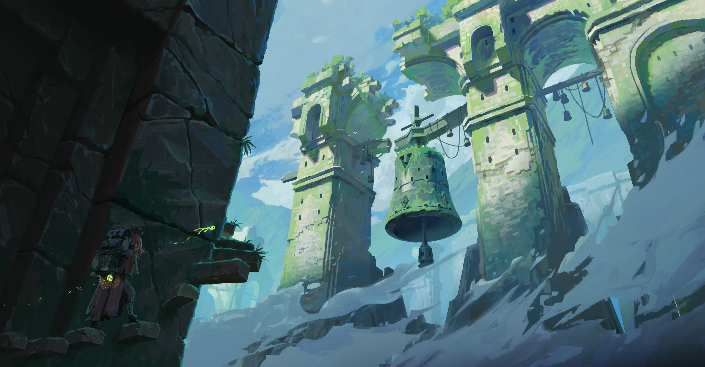

# Note

The vast majority of these wallpapers are taken from random web-sites all over the internet and other repositories with wallpapers, I did not create them.
The only modifications that I have done are cropping, color correction, noise reduction, upscaling, etc.

I tried finding the sources for every image in this wallpaper pack, but it is hard.
If you are the original creator and you would like me to remove your wallpaper from the repository or I gave incorrect credit, please let me know by creating a new issue.


# Usage

You can use the files in the `img/` folder as they are.

However, if you want to have the images to be tagged, use the script included in the `src/` directory. The tagged files will end up in `img_tag/` directory.
```bash
# (These instructions assume that the current working directory is the root of the repo)

# Ensure that all python modules are installed
pip install -r requirements.txt
# Run the script itself
#   No options if you want both the README and the tagged images folder to be updated
#   Add "-r" option if you only want to regenerate the `README.md`
#   Add "-t" option if you only want to tag and save images
#   Add "-h" option if you need more help running the script
src/wallpaper_update.py
```


# Wallpapers

## Firewatch Cliff

### Image


### Details

* **File name**: `FirewatchCliff.png`
* **Tagged name**: `FirewatchCliff_Wide_Flat.png`
* **Size**: Wide
* **Style**: Flat
* **Dominant color**: `(251, 175, 28)`
* **Source**: [link](https://mocah.org/1048987-fantasy-art-sunset-sunrise-looking-into-the-distance-firewatch-dusk-olly-moss-mountain-dawn-plain-sc.html)


## Lakeside

### Image


### Details

* **File name**: `Lakeside.png`
* **Tagged name**: `Lakeside_Ultrawide_Flat.png`
* **Size**: Ultrawide
* **Style**: Flat
* **Dominant color**: `(82, 60, 97)`
* **Source**: [link](https://www.artstation.com/artwork/xzn6xE)


## Saturn Forest

### Image


### Details

* **File name**: `SaturnForest.jpg`
* **Tagged name**: `SaturnForest_Double_Flat.jpg`
* **Size**: Double
* **Style**: Flat
* **Dominant color**: `(55, 40, 67)`
* **Source**: [link](https://www.deviantart.com/rmradev/art/Commission-888769508)


## Cave Wolf

### Image


### Details

* **File name**: `CaveWolf.png`
* **Tagged name**: `CaveWolf_Ultrawide_Flat.png`
* **Size**: Ultrawide
* **Style**: Flat
* **Dominant color**: `(200, 143, 134)`
* **Source**: [link](https://dribbble.com/shots/10200111-Slumber/attachments/2121502?mode=media)


## Lake Deers Bear

### Image


### Details

* **File name**: `LakeDeersBear.png`
* **Tagged name**: `LakeDeersBear_Wide_Flat.png`
* **Size**: Wide
* **Style**: Flat
* **Dominant color**: `(68, 55, 101)`
* **Source**: [link](https://dribbble.com/shots/3200530-Sunrise-wallpaper/attachments/682349?mode=media)


## Foggy Valley

### Image


### Details

* **File name**: `FoggyValley.png`
* **Tagged name**: `FoggyValley_Ultrawide_Flat.png`
* **Size**: Ultrawide
* **Style**: Flat
* **Dominant color**: `(170, 126, 173)`
* **Source**: [link](https://dribbble.com/shots/12078823-The-Valley)


## Foggy Mountains

### Image


### Details

* **File name**: `FoggyMountains.png`
* **Tagged name**: `FoggyMountains_Ultrawide_Photo.png`
* **Size**: Ultrawide
* **Style**: Photo
* **Dominant color**: `(72, 132, 192)`
* **Source**: [link](https://commons.wikimedia.org/wiki/File:Rhythm_of_the_mountains.jpg)


## Caracara On Capybara

### Image


### Details

* **File name**: `CaracaraOnCapybara.jpg`
* **Tagged name**: `CaracaraOnCapybara_Classic_Photo.jpg`
* **Size**: Classic
* **Style**: Photo
* **Dominant color**: `(47, 40, 36)`
* **Source**: [link](https://en.wikipedia.org/wiki/File:Yellow-headed_caracara_(Milvago_chimachima)_on_capybara_(Hydrochoeris_hydrochaeris).JPG)


## Hyper Beast

### Image


### Details

* **File name**: `HyperBeast.jpg`
* **Tagged name**: `HyperBeast_Wide_Drawing.jpg`
* **Size**: Wide
* **Style**: Drawing
* **Dominant color**: `(68, 43, 84)`
* **Source**: [link](https://brockhoferart.com/hyper-beast)


## Dragons

### Image


### Details

* **File name**: `Dragons.jpg`
* **Tagged name**: `Dragons_Wide_Drawing.jpg`
* **Size**: Wide
* **Style**: Drawing
* **Dominant color**: `(57, 44, 51)`
* **Source**: [link](https://brockhoferart.com)


## Carmine Rock

### Image


### Details

* **File name**: `CarmineRock.png`
* **Tagged name**: `CarmineRock_Wide_Drawing.png`
* **Size**: Wide
* **Style**: Drawing
* **Dominant color**: `(57, 59, 69)`
* **Source**: [link](https://www.artstation.com/artwork/awOPk)


## Fishermans Shack

### Image


### Details

* **File name**: `FishermansShack.jpg`
* **Tagged name**: `FishermansShack_Imax_Drawing.jpg`
* **Size**: Imax
* **Style**: Drawing
* **Dominant color**: `(53, 51, 57)`
* **Source**: [link](https://www.artstation.com/artwork/G88dkW)


## Silent Hill Toluca

### Image


### Details

* **File name**: `SilentHillToluca.jpg`
* **Tagged name**: `SilentHillToluca_Wide_Sketch.jpg`
* **Size**: Wide
* **Style**: Sketch
* **Dominant color**: `(139, 160, 169)`
* **Source**: [link](https://eliottsontot.artstation.com/projects/ZG0GK0?album_id=4719001)


## Silent Hill Otherworld

### Image


### Details

* **File name**: `SilentHillOtherworld.jpg`
* **Tagged name**: `SilentHillOtherworld_Classic_Sketch.jpg`
* **Size**: Classic
* **Style**: Sketch
* **Dominant color**: `(26, 34, 38)`
* **Source**: [link](https://eliottsontot.artstation.com/projects/B1LZ2A?album_id=4719001)


## Dusk Vendigo Church

### Image


### Details

* **File name**: `DuskVendigoChurch.png`
* **Tagged name**: `DuskVendigoChurch_Wide_Painting.png`
* **Size**: Wide
* **Style**: Painting
* **Dominant color**: `(32, 7, 5)`
* **Source**: [link](https://store.steampowered.com/app/1846130/DUSK__The_Goodies/)


## Shadowlands

### Image


### Details

* **File name**: `Shadowlands.jpg`
* **Tagged name**: `Shadowlands_Wide_Drawing.jpg`
* **Size**: Wide
* **Style**: Drawing
* **Dominant color**: `(58, 59, 68)`
* **Source**: [link](https://www.reddit.com/r/wallpapers/comments/pzcnwe/shadowlands_by_me/)
* **Notes**: I cropped it


## El Capitan Yosemite Fog

### Image


### Details

* **File name**: `ElCapitanYosemiteFog.jpg`
* **Tagged name**: `ElCapitanYosemiteFog_Square_Photo.jpg`
* **Size**: Square
* **Style**: Photo
* **Dominant color**: `(53, 54, 64)`
* **Source**: [link](https://unsplash.com/photos/YLYfwyPJl-o)


## El Capitan Yosemite Autumn

### Image


### Details

* **File name**: `ElCapitanYosemiteAutumn.jpg`
* **Tagged name**: `ElCapitanYosemiteAutumn_Wide_Photo.jpg`
* **Size**: Wide
* **Style**: Photo
* **Dominant color**: `(45, 50, 54)`
* **Source**: [link](https://imgur.com/a/EyzZD)


## World Of Horror

### Image


### Details

* **File name**: `WorldOfHorror.png`
* **Tagged name**: `WorldOfHorror_Wide_Pixel.png`
* **Size**: Wide
* **Style**: Pixel
* **Dominant color**: `(4, 20, 20)`
* **Source**: [link](https://twitter.com/panstasz/status/829470971878838272/photo/1)
* **Notes**: I extended the sky and colored the image with the palette from the game


## Abandoned Japanese Village

### Image


### Details

* **File name**: `AbandonedJapaneseVillage.png`
* **Tagged name**: `AbandonedJapaneseVillage_Ultrawide_Pixel.png`
* **Size**: Ultrawide
* **Style**: Pixel
* **Dominant color**: `(9, 12, 12)`
* **Source**: [link](https://33.media.tumblr.com/69bdc6308edaad4e8a73e54681b40b6f/tumblr_np9esuAJ0W1sslvquo1_1280.gif)


## Magic Swamp

### Image


### Details

* **File name**: `MagicSwamp.png`
* **Tagged name**: `MagicSwamp_Ultrawide_Pixel.png`
* **Size**: Ultrawide
* **Style**: Pixel
* **Dominant color**: `(32, 32, 29)`
* **Source**: [link](https://imgur.com/zTzuw)


## Foggy Forest Road

### Image


### Details

* **File name**: `FoggyForestRoad.jpg`
* **Tagged name**: `FoggyForestRoad_Wide_Pixel.jpg`
* **Size**: Wide
* **Style**: Pixel
* **Dominant color**: `(55, 58, 42)`
* **Source**: [link](https://unsplash.com/photos/Jr-FXzWqCk0)
* **Notes**: I cropped it


## Samurai Sky Lanterns

### Image


### Details

* **File name**: `SamuraiSkyLanterns.jpg`
* **Tagged name**: `SamuraiSkyLanterns_Wide_Painting.jpg`
* **Size**: Wide
* **Style**: Painting
* **Dominant color**: `(77, 68, 101)`
* **Source**: [link](https://www.deviantart.com/wlop/art/Sky-Lanterns-442002652)


## Counter Play Sky Lanterns

### Image


### Details

* **File name**: `CounterPlaySkyLanterns.jpg`
* **Tagged name**: `CounterPlaySkyLanterns_Wide_Painting.jpg`
* **Size**: Wide
* **Style**: Painting
* **Dominant color**: `(54, 34, 105)`
* **Source**: [link](https://www.counterplaygames.com/#counterplaygames-home)


## Squirrel In Forest

### Image


### Details

* **File name**: `SquirrelInForest.png`
* **Tagged name**: `SquirrelInForest_Wide_Flat.png`
* **Size**: Wide
* **Style**: Flat
* **Dominant color**: `(22, 17, 52)`
* **Source**: [link](https://imgur.com/U8r1J84)


## Catan

### Image


### Details

* **File name**: `Catan.png`
* **Tagged name**: `Catan_Wide_Drawing.png`
* **Size**: Wide
* **Style**: Drawing
* **Dominant color**: `(192, 82, 59)`
* **Source**: [link](http://www.experiment7.com/catanvr)
* **Notes**: Taken from [here](https://wallpx.com/wallpaper/landscape-sunrise-vr-games-field-artwork-catan-vr/)


## Witcher On The Trail

### Image


### Details

* **File name**: `WitcherOnTheTrail.jpg`
* **Tagged name**: `WitcherOnTheTrail_Wide_Drawing.jpg`
* **Size**: Wide
* **Style**: Drawing
* **Dominant color**: `(40, 26, 26)`
* **Source**: [link](https://dekades8.artstation.com/projects/9mAeJa)


## Arikara 1

### Image


### Details

* **File name**: `Arikara1.jpg`
* **Tagged name**: `Arikara1_Wide_Drawing.jpg`
* **Size**: Wide
* **Style**: Drawing
* **Dominant color**: `(69, 52, 47)`
* **Source**: [link](https://www.artstation.com/artwork/q9Qr6a)


## Arikara 2

### Image


### Details

* **File name**: `Arikara2.jpg`
* **Tagged name**: `Arikara2_Wide_Drawing.jpg`
* **Size**: Wide
* **Style**: Drawing
* **Dominant color**: `(58, 38, 29)`
* **Source**: [link](https://www.artstation.com/artwork/q9Qr6a)


## Reload Brewing

### Image


### Details

* **File name**: `ReloadBrewing.jpg`
* **Tagged name**: `ReloadBrewing_Imax_Drawing.jpg`
* **Size**: Imax
* **Style**: Drawing
* **Dominant color**: `(70, 31, 88)`
* **Source**: [link](https://www.artstation.com/artwork/Bm1rX9)


## Revenge Brewing

### Image


### Details

* **File name**: `RevengeBrewing.jpg`
* **Tagged name**: `RevengeBrewing_Imax_Drawing.jpg`
* **Size**: Imax
* **Style**: Drawing
* **Dominant color**: `(30, 15, 50)`
* **Source**: [link](https://www.artstation.com/artwork/YaekX3)


## Ancient Tree Shrine

### Image




### Details

* **File name**: `AncientTreeShrine.png`
* **Tagged name**: `AncientTreeShrine_Wide_Drawing.png`
* **Size**: Wide
* **Style**: Drawing
* **Dominant color**: `(232, 163, 137)`
* **Source**: [link](https://www.artstation.com/artwork/rqbbG)
* **Notes**: I cropped it


## Ancient Artifact

### Image


### Details

* **File name**: `AncientArtifact.jpg`
* **Tagged name**: `AncientArtifact_Wide_Drawing.jpg`
* **Size**: Wide
* **Style**: Drawing
* **Dominant color**: `(64, 45, 49)`
* **Source**: [link](https://www.artstation.com/artwork/2enXv)
* **Notes**: I cropped it


## River Camping

### Image


### Details

* **File name**: `RiverCamping.jpg`
* **Tagged name**: `RiverCamping_Wide_Painting.jpg`
* **Size**: Wide
* **Style**: Painting
* **Dominant color**: `(11, 47, 67)`
* **Source**: [link](https://www.artstation.com/artwork/xOX81)


## Falling Warmth

### Image


### Details

* **File name**: `FallingWarmth.jpeg`
* **Tagged name**: `FallingWarmth_Wide_Painting.jpeg`
* **Size**: Wide
* **Style**: Painting
* **Dominant color**: `(67, 59, 68)`
* **Source**: [link](https://www.deviantart.com/chibionpu/art/Falling-Warmth-491264246)
* **Notes**: Taken from [here](https://imgur.com/gallery/yMQl5)


## Lake Cabin

### Image


### Details

* **File name**: `LakeCabin.jpg`
* **Tagged name**: `LakeCabin_Wide_Painting.jpg`
* **Size**: Wide
* **Style**: Painting
* **Dominant color**: `(19, 76, 69)`
* **Source**: [link](https://www.artstation.com/artwork/gR48E)


## Autumn Forest Cabins

### Image


### Details

* **File name**: `AutumnForestCabins.jpg`
* **Tagged name**: `AutumnForestCabins_Imax_Drawing.jpg`
* **Size**: Imax
* **Style**: Drawing
* **Dominant color**: `(98, 67, 43)`
* **Source**: [link](https://www.artstation.com/artwork/lxeX8J)


## Secret Ruined Place

### Image


### Details

* **File name**: `SecretRuinedPlace.jpg`
* **Tagged name**: `SecretRuinedPlace_Cinematic_Painting.jpg`
* **Size**: Cinematic
* **Style**: Painting
* **Dominant color**: `(62, 50, 43)`
* **Source**: [link](https://www.artstation.com/artwork/0ew55)


## Red Fury

### Image


### Details

* **File name**: `RedFury.jpg`
* **Tagged name**: `RedFury_Ultrawide_Drawing.jpg`
* **Size**: Ultrawide
* **Style**: Drawing
* **Dominant color**: `(54, 9, 8)`
* **Source**: [link](https://www.artstation.com/artwork/ZePXbZ)


## Spark In The Darkness

### Image


### Details

* **File name**: `SparkInTheDarkness.jpg`
* **Tagged name**: `SparkInTheDarkness_Classic_Drawing.jpg`
* **Size**: Classic
* **Style**: Drawing
* **Dominant color**: `(70, 66, 72)`
* **Source**: [link](https://www.artstation.com/artwork/q8kqL)


## Dark Rider

### Image


### Details

* **File name**: `DarkRider.jpg`
* **Tagged name**: `DarkRider_Wide_Drawing.jpg`
* **Size**: Wide
* **Style**: Drawing
* **Dominant color**: `(55, 51, 47)`
* **Source**: [link](https://www.artstation.com/artwork/W2YgQD)


## 2b Iron Giant

### Image


### Details

* **File name**: `2bIronGiant.jpg`
* **Tagged name**: `2bIronGiant_Classic_Painting.jpg`
* **Size**: Classic
* **Style**: Painting
* **Dominant color**: `(29, 50, 28)`
* **Source**: [link](https://www.artstation.com/artwork/8QnB6)


## First Day Of The Work

### Image


### Details

* **File name**: `FirstDayOfTheWork.jpg`
* **Tagged name**: `FirstDayOfTheWork_Wide_Painting.jpg`
* **Size**: Wide
* **Style**: Painting
* **Dominant color**: `(57, 119, 149)`
* **Source**: [link](https://www.artstation.com/artwork/0WbOw)


## Blue Lagoon

### Image


### Details

* **File name**: `BlueLagoon.jpg`
* **Tagged name**: `BlueLagoon_Cinematic_Drawing.jpg`
* **Size**: Cinematic
* **Style**: Drawing
* **Dominant color**: `(197, 195, 199)`
* **Source**: [link](https://www.artstation.com/artwork/rAYL62)


## Autumn Puddle

### Image


### Details

* **File name**: `AutumnPuddle.jpg`
* **Tagged name**: `AutumnPuddle_Cinematic_Drawing.jpg`
* **Size**: Cinematic
* **Style**: Drawing
* **Dominant color**: `(55, 56, 55)`
* **Source**: [link](https://www.artstation.com/artwork/rAX3qL)


## Fall

### Image


### Details

* **File name**: `Fall.jpg`
* **Tagged name**: `Fall_Imax_Drawing.jpg`
* **Size**: Imax
* **Style**: Drawing
* **Dominant color**: `(48, 35, 33)`
* **Source**: [link](https://www.artstation.com/artwork/oAxYDO)


## Jungle

### Image


### Details

* **File name**: `Jungle.jpg`
* **Tagged name**: `Jungle_Cinematic_Drawing.jpg`
* **Size**: Cinematic
* **Style**: Drawing
* **Dominant color**: `(22, 40, 28)`
* **Source**: [link](https://www.artstation.com/artwork/KaYNWG)


## Skull Temple

### Image


### Details

* **File name**: `SkullTemple.jpg`
* **Tagged name**: `SkullTemple_Wide_Drawing.jpg`
* **Size**: Wide
* **Style**: Drawing
* **Dominant color**: `(22, 33, 41)`
* **Source**: [link](https://www.artstation.com/artwork/W2aywX)


## Forest At Night

### Image


### Details

* **File name**: `ForestAtNight.jpg`
* **Tagged name**: `ForestAtNight_Classic_Photo.jpg`
* **Size**: Classic
* **Style**: Photo
* **Dominant color**: `(54, 44, 43)`
* **Source**: [link](https://www.pexels.com/photo/forest-at-night-2080963/)


## Cloudy Sea

### Image


### Details

* **File name**: `CloudySea.jpg`
* **Tagged name**: `CloudySea_Wide_Painting.jpg`
* **Size**: Wide
* **Style**: Painting
* **Dominant color**: `(118, 74, 107)`
* **Source**: [link](https://www.artstation.com/artwork/gYQam)


## Creek

### Image


### Details

* **File name**: `Creek.jpg`
* **Tagged name**: `Creek_Cinematic_Painting.jpg`
* **Size**: Cinematic
* **Style**: Painting
* **Dominant color**: `(50, 51, 31)`
* **Source**: [link](https://www.artstation.com/artwork/eEVxw)


## Dead Giant

### Image


### Details

* **File name**: `DeadGiant.jpg`
* **Tagged name**: `DeadGiant_Wide_Painting.jpg`
* **Size**: Wide
* **Style**: Painting
* **Dominant color**: `(64, 66, 45)`
* **Source**: [link](https://www.artstation.com/artwork/bEyWv)


## After

### Image




### Details

* **File name**: `After.jpg`
* **Tagged name**: `After_Wide_Drawing.jpg`
* **Size**: Wide
* **Style**: Drawing
* **Dominant color**: `(43, 31, 26)`
* **Source**: [link](https://www.artstation.com/artwork/L0ZNA)


## Companions

### Image


### Details

* **File name**: `Companions.jpg`
* **Tagged name**: `Companions_Wide_Painting.jpg`
* **Size**: Wide
* **Style**: Painting
* **Dominant color**: `(49, 42, 24)`
* **Source**: [link](https://www.artstation.com/artwork/dNv3K)


## Spine Of The World

### Image


### Details

* **File name**: `SpineOfTheWorld.jpg`
* **Tagged name**: `SpineOfTheWorld_Wide_Drawing.jpg`
* **Size**: Wide
* **Style**: Drawing
* **Dominant color**: `(51, 36, 32)`
* **Source**: [link](https://www.deviantart.com/joeyjazz/art/Spine-of-the-World-905172672)


## The Pilgrim

### Image


### Details

* **File name**: `ThePilgrim.jpg`
* **Tagged name**: `ThePilgrim_Wide_Drawing.jpg`
* **Size**: Wide
* **Style**: Drawing
* **Dominant color**: `(65, 63, 64)`
* **Source**: [link](https://www.deviantart.com/joeyjazz/art/The-Pilgrim-904251780)


## Long Way To Eden

### Image


### Details

* **File name**: `LongWayToEden.jpg`
* **Tagged name**: `LongWayToEden_Ultrawide_Drawing.jpg`
* **Size**: Ultrawide
* **Style**: Drawing
* **Dominant color**: `(74, 54, 55)`
* **Source**: [link](https://www.deviantart.com/joeyjazz/art/Long-Way-to-Eden-885804027)


## The Lesson

### Image


### Details

* **File name**: `TheLesson.jpg`
* **Tagged name**: `TheLesson_Wide_Drawing.jpg`
* **Size**: Wide
* **Style**: Drawing
* **Dominant color**: `(228, 132, 63)`
* **Source**: [link](https://www.deviantart.com/joeyjazz/art/The-Lesson-860310673)


## Reflective Moments

### Image


### Details

* **File name**: `ReflectiveMoments.jpg`
* **Tagged name**: `ReflectiveMoments_Wide_Drawing.jpg`
* **Size**: Wide
* **Style**: Drawing
* **Dominant color**: `(34, 13, 17)`
* **Source**: [link](https://www.deviantart.com/joeyjazz/art/Reflective-Moments-831598974)


## I Of The Trident

### Image


### Details

* **File name**: `IOfTheTrident.jpg`
* **Tagged name**: `IOfTheTrident_Wide_Drawing.jpg`
* **Size**: Wide
* **Style**: Drawing
* **Dominant color**: `(26, 71, 116)`
* **Source**: [link](https://www.deviantart.com/joeyjazz/art/I-of-the-Trident-814933262)


## At Autumns Door

### Image


### Details

* **File name**: `AtAutumnsDoor.jpg`
* **Tagged name**: `AtAutumnsDoor_Wide_Painting.jpg`
* **Size**: Wide
* **Style**: Painting
* **Dominant color**: `(58, 98, 88)`
* **Source**: [link](https://www.deviantart.com/joeyjazz/art/At-Autumn-s-Door-813813455)


## Of Elves And Greenlands

### Image


### Details

* **File name**: `OfElvesAndGreenlands.png`
* **Tagged name**: `OfElvesAndGreenlands_Wide_Drawing.png`
* **Size**: Wide
* **Style**: Drawing
* **Dominant color**: `(66, 75, 44)`
* **Source**: [link](https://www.deviantart.com/joeyjazz/art/Of-Elves-and-Greenlands-805431365)


## Of Men And Castles

### Image


### Details

* **File name**: `OfMenAndCastles.png`
* **Tagged name**: `OfMenAndCastles_Wide_Drawing.png`
* **Size**: Wide
* **Style**: Drawing
* **Dominant color**: `(157, 40, 18)`
* **Source**: [link](https://www.deviantart.com/joeyjazz/art/Of-Men-and-Castles-805665913)


## Eye See You

### Image


### Details

* **File name**: `EyeSeeYou.png`
* **Tagged name**: `EyeSeeYou_Wide_Painting.png`
* **Size**: Wide
* **Style**: Painting
* **Dominant color**: `(55, 13, 4)`
* **Source**: [link](https://www.deviantart.com/joeyjazz/art/Eye-See-You-786504133)


## Times Long Gone

### Image


### Details

* **File name**: `TimesLongGone.jpg`
* **Tagged name**: `TimesLongGone_Wide_Drawing.jpg`
* **Size**: Wide
* **Style**: Drawing
* **Dominant color**: `(5, 18, 36)`
* **Source**: [link](https://www.deviantart.com/joeyjazz/art/Times-Long-Gone-784335842)


## The Loneliness Of Swahn

### Image


### Details

* **File name**: `TheLonelinessOfSwahn.jpg`
* **Tagged name**: `TheLonelinessOfSwahn_Wide_Drawing.jpg`
* **Size**: Wide
* **Style**: Drawing
* **Dominant color**: `(51, 48, 47)`
* **Source**: [link](https://www.artstation.com/artwork/w8amx9)


## I Just Want To Be Happy

### Image




### Details

* **File name**: `IJustWantToBeHappy.jpg`
* **Tagged name**: `IJustWantToBeHappy_Classic_Drawing.jpg`
* **Size**: Classic
* **Style**: Drawing
* **Dominant color**: `(45, 47, 39)`
* **Source**: [link](https://www.artstation.com/artwork/rAGoB5)


## White Tower

### Image


### Details

* **File name**: `WhiteTower.jpg`
* **Tagged name**: `WhiteTower_Imax_Painting.jpg`
* **Size**: Imax
* **Style**: Painting
* **Dominant color**: `(47, 54, 56)`
* **Source**: [link](https://somartist.artstation.com/projects/GXxzlW)


## Kerevel Corridor

### Image


### Details

* **File name**: `KerevelCorridor.jpg`
* **Tagged name**: `KerevelCorridor_Ultrawide_Drawing.jpg`
* **Size**: Ultrawide
* **Style**: Drawing
* **Dominant color**: `(52, 61, 64)`
* **Source**: [link](https://www.artstation.com/artwork/OoQv5g)


## Cathedral Of Tharnas

### Image


### Details

* **File name**: `CathedralOfTharnas.jpg`
* **Tagged name**: `CathedralOfTharnas_Wide_Drawing.jpg`
* **Size**: Wide
* **Style**: Drawing
* **Dominant color**: `(48, 64, 64)`
* **Source**: [link](https://www.artstation.com/artwork/oAaLoW)


## Temple Ruin

### Image


### Details

* **File name**: `TempleRuin.jpg`
* **Tagged name**: `TempleRuin_Wide_Drawing.jpg`
* **Size**: Wide
* **Style**: Drawing
* **Dominant color**: `(22, 34, 56)`
* **Source**: [link](https://www.artstation.com/artwork/W2LrG3)


## Valley Of The Gods

### Image


### Details

* **File name**: `ValleyOfTheGods.jpg`
* **Tagged name**: `ValleyOfTheGods_Imax_Painting.jpg`
* **Size**: Imax
* **Style**: Painting
* **Dominant color**: `(52, 36, 65)`
* **Source**: [link](https://www.artstation.com/artwork/5Xvw9P)


## The Source

### Image


### Details

* **File name**: `TheSource.jpg`
* **Tagged name**: `TheSource_Imax_Painting.jpg`
* **Size**: Imax
* **Style**: Painting
* **Dominant color**: `(47, 54, 55)`
* **Source**: [link](https://www.artstation.com/artwork/oOLPoz)


## Landscape

### Image




### Details

* **File name**: `Landscape.jpg`
* **Tagged name**: `Landscape_Wide_Painting.jpg`
* **Size**: Wide
* **Style**: Painting
* **Dominant color**: `(34, 32, 26)`
* **Source**: [link](https://www.artstation.com/artwork/PoEqd4)


## Forest

### Image


### Details

* **File name**: `Forest.jpg`
* **Tagged name**: `Forest_Classic_Painting.jpg`
* **Size**: Classic
* **Style**: Painting
* **Dominant color**: `(31, 42, 25)`
* **Source**: [link](https://www.artstation.com/artwork/aGGd89)


## Forest Flowering Season

### Image


### Details

* **File name**: `ForestFloweringSeason.jpg`
* **Tagged name**: `ForestFloweringSeason_Wide_Painting.jpg`
* **Size**: Wide
* **Style**: Painting
* **Dominant color**: `(77, 86, 114)`
* **Source**: [link](https://www.artstation.com/artwork/05avY)


## Blind Warden

### Image


### Details

* **File name**: `BlindWarden.jpg`
* **Tagged name**: `BlindWarden_Wide_Drawing.jpg`
* **Size**: Wide
* **Style**: Drawing
* **Dominant color**: `(27, 27, 32)`
* **Source**: [link](https://www.artstation.com/artwork/yvOz8)


## Small Memory

### Image


### Details

* **File name**: `SmallMemory.png`
* **Tagged name**: `SmallMemory_Wide_Flat.png`
* **Size**: Wide
* **Style**: Flat
* **Dominant color**: `(8, 41, 69)`
* **Source**: [link](https://dribbble.com/shots/3713646-Small-Memory)


## Ravens Gate

### Image


### Details

* **File name**: `RavensGate.jpg`
* **Tagged name**: `RavensGate_Wide_Drawing.jpg`
* **Size**: Wide
* **Style**: Drawing
* **Dominant color**: `(67, 131, 132)`
* **Source**: [link](https://www.artstation.com/artwork/2xBlde)


## Night Rider

### Image




### Details

* **File name**: `NightRider.png`
* **Tagged name**: `NightRider_Wide_Painting.png`
* **Size**: Wide
* **Style**: Painting
* **Dominant color**: `(21, 33, 39)`
* **Source**: [link](https://www.deviantart.com/bisbiswas/art/Night-Rider-878358780)


## Red Trees Mountains

### Image


### Details

* **File name**: `RedTreesMountains.jpg`
* **Tagged name**: `RedTreesMountains_Wide_Drawing.jpg`
* **Size**: Wide
* **Style**: Drawing
* **Dominant color**: `(69, 71, 74)`
* **Source**: [link](https://www.artstation.com/artwork/mDKZQE)


## Red Fishes Among Red Trees

### Image


### Details

* **File name**: `RedFishesAmongRedTrees.png`
* **Tagged name**: `RedFishesAmongRedTrees_Wide_Drawing.png`
* **Size**: Wide
* **Style**: Drawing
* **Dominant color**: `(67, 52, 64)`
* **Source**: [link](https://www.deviantart.com/skyrawathi/art/Red-fishes-among-the-red-trees-765783469)


## Blossoms

### Image


### Details

* **File name**: `Blossoms.png`
* **Tagged name**: `Blossoms_Wide_Painting.png`
* **Size**: Wide
* **Style**: Painting
* **Dominant color**: `(65, 59, 54)`
* **Source**: [link](https://www.deviantart.com/tacosauceninja/art/Blossoms-762704280)


## Meteor Shower

### Image


### Details

* **File name**: `MeteorShower.jpg`
* **Tagged name**: `MeteorShower_Wide_Drawing.jpg`
* **Size**: Wide
* **Style**: Drawing
* **Dominant color**: `(20, 35, 43)`
* **Source**: [link](https://www.artstation.com/artwork/Ar253o)


## Arrival

### Image


### Details

* **File name**: `Arrival.jpg`
* **Tagged name**: `Arrival_Wide_Drawing.jpg`
* **Size**: Wide
* **Style**: Drawing
* **Dominant color**: `(33, 21, 38)`
* **Source**: [link](https://www.artstation.com/artwork/28ex6v)


## Under The Night Sky

### Image


### Details

* **File name**: `UnderTheNightSky.jpg`
* **Tagged name**: `UnderTheNightSky_Wide_Drawing.jpg`
* **Size**: Wide
* **Style**: Drawing
* **Dominant color**: `(19, 27, 61)`
* **Source**: [link](https://www.artstation.com/artwork/2x6z3a)


## Late Evening

### Image


### Details

* **File name**: `LateEvening.jpg`
* **Tagged name**: `LateEvening_Wide_Painting.jpg`
* **Size**: Wide
* **Style**: Painting
* **Dominant color**: `(36, 32, 31)`
* **Source**: [link](https://www.artstation.com/artwork/lV6adk)


## Sky Light

### Image


### Details

* **File name**: `SkyLight.jpg`
* **Tagged name**: `SkyLight_Wide_Drawing.jpg`
* **Size**: Wide
* **Style**: Drawing
* **Dominant color**: `(24, 8, 56)`
* **Source**: [link](https://www.deviantart.com/bisbiswas/art/Sky-light-852835379)


## Strangers In A Strange World

### Image


### Details

* **File name**: `StrangersInAStrangeWorld.jpg`
* **Tagged name**: `StrangersInAStrangeWorld_Wide_Drawing.jpg`
* **Size**: Wide
* **Style**: Drawing
* **Dominant color**: `(28, 65, 108)`
* **Source**: [link](https://www.artstation.com/artwork/OyNl5k)


## White Blue Red Clouds

### Image


### Details

* **File name**: `WhiteBlueRedClouds.jpg`
* **Tagged name**: `WhiteBlueRedClouds_Wide_Drawing.jpg`
* **Size**: Wide
* **Style**: Drawing
* **Dominant color**: `(185, 199, 162)`
* **Source**: [link](https://www.deviantart.com/hangmoon/art/White-Blue-Red-Clouds-719909350)
* **Notes**: Taken from [here](https://github.com/mut-ex/wallpapers/blob/master/landscapebright.jpg)


## Listen To Your Heart

### Image


### Details

* **File name**: `ListenToYourHeart.png`
* **Tagged name**: `ListenToYourHeart_Ultrawide_Drawing.png`
* **Size**: Ultrawide
* **Style**: Drawing
* **Dominant color**: `(17, 34, 56)`
* **Source**: [link](https://www.artstation.com/artwork/oqR1W)
* **Notes**: Taken from [here](https://i.imgur.com/XSQSo0O.png)


## Mercy

### Image


### Details

* **File name**: `Mercy.jpg`
* **Tagged name**: `Mercy_Wide_Drawing.jpg`
* **Size**: Wide
* **Style**: Drawing
* **Dominant color**: `(5, 88, 99)`
* **Source**: [link](https://www.deviantart.com/joeyjazz/art/Mercy-Wallpaper-541981768)
* **Notes**: Taken from [here](https://github.com/mut-ex/wallpapers/blob/master/whale.jpg)


## Clouds

### Image


### Details

* **File name**: `Clouds.png`
* **Tagged name**: `Clouds_Wide_Flat.png`
* **Size**: Wide
* **Style**: Flat
* **Dominant color**: `(29, 32, 73)`
* **Source**: [link](https://www.newgrounds.com/art/view/souredapple/clouds)


## Desert Flames

### Image


### Details

* **File name**: `DesertFlames.jpg`
* **Tagged name**: `DesertFlames_Imax_Drawing.jpg`
* **Size**: Imax
* **Style**: Drawing
* **Dominant color**: `(52, 60, 120)`
* **Source**: [link](https://www.artstation.com/artwork/NXZmP)


## The Neon Shallows

### Image


### Details

* **File name**: `TheNeonShallows.png`
* **Tagged name**: `TheNeonShallows_Wide_Flat.png`
* **Size**: Wide
* **Style**: Flat
* **Dominant color**: `(32, 41, 45)`
* **Source**: [link](https://www.deviantart.com/leikoi/art/The-Neon-Shallows-823330548)


## Horizon Zero Dawn

### Image




### Details

* **File name**: `HorizonZeroDawn.jpg`
* **Tagged name**: `HorizonZeroDawn_Wide_Flat.jpg`
* **Size**: Wide
* **Style**: Flat
* **Dominant color**: `(35, 47, 42)`
* **Source**: [link](https://www.flickr.com/photos/playstationblog/50279384777/in/photostream/)


## The Secret Of The Blue Planet

### Image


### Details

* **File name**: `TheSecretOfTheBluePlanet.jpg`
* **Tagged name**: `TheSecretOfTheBluePlanet_Imax_Painting.jpg`
* **Size**: Imax
* **Style**: Painting
* **Dominant color**: `(78, 86, 104)`
* **Source**: [link](https://evakosmos.myportfolio.com/the-secret-of-the-blue-planet)


## Away From The Herd

### Image


### Details

* **File name**: `AwayFromTheHerd.jpg`
* **Tagged name**: `AwayFromTheHerd_Classic_Painting.jpg`
* **Size**: Classic
* **Style**: Painting
* **Dominant color**: `(109, 109, 145)`
* **Source**: [link](https://evakosmos.myportfolio.com/away-from-the-herd)


## Amaazing

### Image


### Details

* **File name**: `Amaazing.png`
* **Tagged name**: `Amaazing_Wide_Drawing.png`
* **Size**: Wide
* **Style**: Drawing
* **Dominant color**: `(223, 94, 50)`
* **Source**: [link](https://www.deviantart.com/emregursoz/art/Amaazing-459834468)


## Beautiful Clouds Forest

### Image


### Details

* **File name**: `BeautifulCloudsForest.jpg`
* **Tagged name**: `BeautifulCloudsForest_Classic_Photo.jpg`
* **Size**: Classic
* **Style**: Photo
* **Dominant color**: `(36, 66, 91)`
* **Source**: [link](https://www.shutterstock.com/image-photo/beautiful-clouds-forest-1224378124)
* **Notes**: Taken from [here](https://blog.csdn.net/Alone_in_/article/details/97135203)


## Stag Night

### Image


### Details

* **File name**: `StagNight.jpg`
* **Tagged name**: `StagNight_Wide_Photo.jpg`
* **Size**: Wide
* **Style**: Photo
* **Dominant color**: `(45, 70, 72)`
* **Source**: [link](https://www.flickr.com/photos/gill-was-here/23486219036/sizes/l)


## Star Dust

### Image


### Details

* **File name**: `StarDust.jpg`
* **Tagged name**: `StarDust_Wide_Painting.jpg`
* **Size**: Wide
* **Style**: Painting
* **Dominant color**: `(45, 89, 135)`
* **Source**: [link](https://www.artstation.com/artwork/4Xa124)


## Wings

### Image


### Details

* **File name**: `Wings.jpg`
* **Tagged name**: `Wings_Wide_Painting.jpg`
* **Size**: Wide
* **Style**: Painting
* **Dominant color**: `(86, 104, 136)`
* **Source**: [link](https://www.artstation.com/artwork/68A2ZV)


## Budapest

### Image


### Details

* **File name**: `Budapest.jpg`
* **Tagged name**: `Budapest_Wide_Painting.jpg`
* **Size**: Wide
* **Style**: Painting
* **Dominant color**: `(71, 79, 93)`
* **Source**: [link](https://www.artstation.com/artwork/0ne3ye)


## Wait

### Image


### Details

* **File name**: `Wait.jpg`
* **Tagged name**: `Wait_Wide_Painting.jpg`
* **Size**: Wide
* **Style**: Painting
* **Dominant color**: `(59, 99, 126)`
* **Source**: [link](https://www.artstation.com/artwork/lVJXXe)


## Beyond Hill And Dale

### Image


### Details

* **File name**: `BeyondHillAndDale.jpg`
* **Tagged name**: `BeyondHillAndDale_Wide_Painting.jpg`
* **Size**: Wide
* **Style**: Painting
* **Dominant color**: `(37, 78, 101)`
* **Source**: [link](https://www.artstation.com/artwork/W2XQYN)


## Quiet Mind

### Image




### Details

* **File name**: `QuietMind.jpg`
* **Tagged name**: `QuietMind_Wide_Painting.jpg`
* **Size**: Wide
* **Style**: Painting
* **Dominant color**: `(128, 184, 193)`
* **Source**: [link](https://www.artstation.com/artwork/Y20RX)


## Serenity

### Image


### Details

* **File name**: `Serenity.jpg`
* **Tagged name**: `Serenity_Wide_Painting.jpg`
* **Size**: Wide
* **Style**: Painting
* **Dominant color**: `(39, 37, 42)`
* **Source**: [link](https://www.artstation.com/artwork/reodm)


## Land Lynx

### Image


### Details

* **File name**: `LandLynx.jpg`
* **Tagged name**: `LandLynx_Wide_Drawing.jpg`
* **Size**: Wide
* **Style**: Drawing
* **Dominant color**: `(11, 69, 66)`
* **Source**: [link](https://www.artstation.com/artwork/LZAww)


## Mist

### Image


### Details

* **File name**: `Mist.jpg`
* **Tagged name**: `Mist_Wide_Drawing.jpg`
* **Size**: Wide
* **Style**: Drawing
* **Dominant color**: `(139, 143, 152)`
* **Source**: [link](https://www.artstation.com/artwork/46ONY)


## Towards The Sun

### Image


### Details

* **File name**: `TowardsTheSun.jpg`
* **Tagged name**: `TowardsTheSun_Wide_Flat.jpg`
* **Size**: Wide
* **Style**: Flat
* **Dominant color**: `(34, 36, 68)`
* **Source**: [link](https://www.deviantart.com/xlocky/art/Towards-the-sun-719827264)


## Orion 3

### Image




### Details

* **File name**: `Orion3.jpg`
* **Tagged name**: `Orion3_Ultrawide_Drawing.jpg`
* **Size**: Ultrawide
* **Style**: Drawing
* **Dominant color**: `(20, 37, 42)`
* **Source**: [link](https://www.artstation.com/artwork/YaRdJd)


## Train During Night Time

### Image


### Details

* **File name**: `TrainDuringNightTime.jpg`
* **Tagged name**: `TrainDuringNightTime_Wide_Photo.jpg`
* **Size**: Wide
* **Style**: Photo
* **Dominant color**: `(12, 24, 29)`
* **Source**: [link](https://unsplash.com/photos/vIoGFrIzmfo)


## M030190804B

### Image


### Details

* **File name**: `M030190804B.jpg`
* **Tagged name**: `M030190804B_Wide_Drawing.jpg`
* **Size**: Wide
* **Style**: Drawing
* **Dominant color**: `(49, 48, 63)`
* **Source**: [link](https://www.deviantart.com/u-joe/art/M030190804b-850875944)


## M030190804

### Image


### Details

* **File name**: `M030190804.jpg`
* **Tagged name**: `M030190804_Wide_Drawing.jpg`
* **Size**: Wide
* **Style**: Drawing
* **Dominant color**: `(59, 76, 63)`
* **Source**: [link](https://www.deviantart.com/u-joe/art/M030190804-850875886)


## Misty Lake

### Image


### Details

* **File name**: `MistyLake.png`
* **Tagged name**: `MistyLake_Wide_Drawing.png`
* **Size**: Wide
* **Style**: Drawing
* **Dominant color**: `(121, 114, 109)`
* **Source**: [link](https://www.deviantart.com/u-joe/art/Misty-lake-for-AWA-Touhou-Scroll-Project-404645328)


## Moriya Shrine

### Image


### Details

* **File name**: `MoriyaShrine.jpg`
* **Tagged name**: `MoriyaShrine_Wide_Drawing.jpg`
* **Size**: Wide
* **Style**: Drawing
* **Dominant color**: `(106, 36, 18)`
* **Source**: [link](https://www.patreon.com/posts/m030210604-52076641)


## Myouren Temple

### Image


### Details

* **File name**: `MyourenTemple.jpg`
* **Tagged name**: `MyourenTemple_Wide_Drawing.jpg`
* **Size**: Wide
* **Style**: Drawing
* **Dominant color**: `(38, 40, 52)`
* **Source**: [link](https://www.patreon.com/posts/myouren-temple-49184698)


## The Bell

### Image




### Details

* **File name**: `TheBell.jpg`
* **Tagged name**: `TheBell_Imax_Drawing.jpg`
* **Size**: Imax
* **Style**: Drawing
* **Dominant color**: `(37, 56, 62)`
* **Source**: [link](https://www.artstation.com/artwork/rR84na)


## Sand Ruins

### Image


### Details

* **File name**: `SandRuins.jpg`
* **Tagged name**: `SandRuins_Ultrawide_Drawing.jpg`
* **Size**: Ultrawide
* **Style**: Drawing
* **Dominant color**: `(186, 195, 196)`
* **Source**: [link](https://www.artstation.com/artwork/EVZ2b4)


## Hocking Hills State Park

### Image


### Details

* **File name**: `HockingHillsStatePark.jpg`
* **Tagged name**: `HockingHillsStatePark_Imax_Photo.jpg`
* **Size**: Imax
* **Style**: Photo
* **Dominant color**: `(42, 34, 18)`
* **Source**: [link](https://stock.adobe.com/images/sunlight-through-the-forest/439455711)
* **Notes**: Taken from [here](https://www.wallpaperup.com/991640/Waterfalls_USA_Crag_Trees_Hocking_Hills_State_Park_Ohio_Nature.html)


## Capybaras

### Image


### Details

* **File name**: `Capybaras.jpg`
* **Tagged name**: `Capybaras_Wide_Photo.jpg`
* **Size**: Wide
* **Style**: Photo
* **Dominant color**: `(76, 61, 45)`
* **Source**: [link](https://mobile.twitter.com/authmarensmith/status/1518994107921805313/photo/1)


## Icy Peaks

### Image


### Details

* **File name**: `IcyPeaks.jpg`
* **Tagged name**: `IcyPeaks_Ultrawide_Drawing.jpg`
* **Size**: Ultrawide
* **Style**: Drawing
* **Dominant color**: `(103, 113, 126)`
* **Source**: [link](https://alex_olmedo.artstation.com/projects/zkvx4?album_id=584566)


## New Horizons

### Image


### Details

* **File name**: `NewHorizons.jpg`
* **Tagged name**: `NewHorizons_Wide_Painting.jpg`
* **Size**: Wide
* **Style**: Painting
* **Dominant color**: `(62, 86, 116)`
* **Source**: [link](https://alex_olmedo.artstation.com/projects/l9BJa?album_id=584570)


## Explorer

### Image


### Details

* **File name**: `Explorer.jpg`
* **Tagged name**: `Explorer_Cinematic_Drawing.jpg`
* **Size**: Cinematic
* **Style**: Drawing
* **Dominant color**: `(45, 56, 37)`
* **Source**: [link](https://alex_olmedo.artstation.com/projects/6R3d6?album_id=584566)


## The World Of Oberon

### Image


### Details

* **File name**: `TheWorldOfOberon.jpg`
* **Tagged name**: `TheWorldOfOberon_Imax_Drawing.jpg`
* **Size**: Imax
* **Style**: Drawing
* **Dominant color**: `(20, 54, 45)`
* **Source**: [link](https://alex_olmedo.artstation.com/projects/nPvo?album_id=584566)


## Forgotten Lands

### Image


### Details

* **File name**: `ForgottenLands.jpg`
* **Tagged name**: `ForgottenLands_Imax_Drawing.jpg`
* **Size**: Imax
* **Style**: Drawing
* **Dominant color**: `(30, 36, 38)`
* **Source**: [link](https://alex_olmedo.artstation.com/projects/m6Ov9?album_id=584566)
